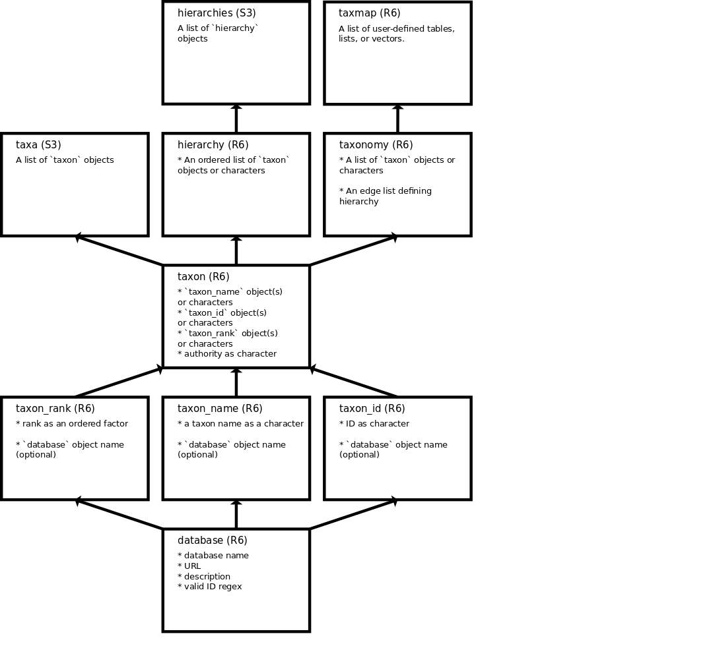

taxa
====

`taxa` defines taxonomic classes and functions to manipulate them. The
goal is to use these classes as low level fundamental taxonomic classes
that other R packages can build on and use.

There are two distinct types of classes in `taxa`:

-   Classes that are concerned only with taxonomic information: `taxon`,
    `taxonomy`, `hierarchy`, etc.
-   A class called `taxmap` that is concerned with combining taxonomic
    data with user-defined data of any type (e.g. molecular sequences,
    abundance counts etc.)

Diagram of class concepts for `taxa` classes:

Install
-------

Development version from GitHub

    devtools::install_github("ropensci/taxa")

    library("taxa")

The classes
-----------

### Minor component classes

There a few optional classes used to store information in other classes.
In most cases, these can be replaced with simple character values but
using them provides more information and potential functionality.

#### `database`

Taxonomic data usually comes from a database. A common example is the
[NCBI Taxonomy Database](https://www.ncbi.nlm.nih.gov/taxonomy) used to
provide taxonomic classifications to sequences deposited in [other NCBI
databases](https://www.ncbi.nlm.nih.gov/guide/all/). The `database`
class stores the name of the database and associated information:

    (ncbi <- taxon_database(
      name = "ncbi",
      url = "http://www.ncbi.nlm.nih.gov/taxonomy",
      description = "NCBI Taxonomy Database",
      id_regex = "*"
    ))
    #> <database> ncbi
    #>   url: http://www.ncbi.nlm.nih.gov/taxonomy
    #>   description: NCBI Taxonomy Database
    #>   id regex: *
    ncbi$name
    #> [1] "ncbi"
    ncbi$url
    #> [1] "http://www.ncbi.nlm.nih.gov/taxonomy"

To save on memory, a selection of common databases is provided with the
package (`database_list`) and any in this list can be used by name
instead of making a new database object (e.g. `"ncbi"` instead of the
`ncbi` above).

    database_list
    #> $ncbi
    #> <database> ncbi
    #>   url: http://www.ncbi.nlm.nih.gov/taxonomy
    #>   description: NCBI Taxonomy Database
    #>   id regex: .*
    #>
    #> $gbif
    #> <database> gbif
    #>   url: http://www.gbif.org/developer/species
    #>   description: GBIF Taxonomic Backbone
    #>   id regex: .*
    #>
    #> $bold
    #> <database> bold
    #>   url: http://www.boldsystems.org
    #>   description: Barcode of Life
    #>   id regex: .*
    #>
    #> $col
    #> <database> col
    #>   url: http://www.catalogueoflife.org
    #>   description: Catalogue of Life
    #>   id regex: .*
    #>
    #> $eol
    #> <database> eol
    #>   url: http://eol.org
    #>   description: Encyclopedia of Life
    #>   id regex: .*
    #>
    #> $nbn
    #> <database> nbn
    #>   url: https://nbn.org.uk
    #>   description: UK National Biodiversity Network
    #>   id regex: .*
    #>
    #> $tps
    #> <database> tps
    #>   url: http://www.tropicos.org/
    #>   description: Tropicos
    #>   id regex: .*
    #>
    #> $itis
    #> <database> itis
    #>   url: http://www.itis.gov
    #>   description: Integrated Taxonomic Information System
    #>   id regex: .*

#### `rank`

Taxa might have defined ranks (e.g. species, family, etc.), ambiguous
ranks (e.g. "unranked", "unknown"), or no rank information at all. The
particular selection and format of valid ranks varies with database, so
the database can be optionally defined. If no database is defined, any
ranks in any order are allowed.

    taxon_rank(name = "species", database = "ncbi")
    #> <TaxonRank> species
    #>   database: ncbi

#### `taxon_name`

The taxon name can be defined in the same way as rank.

    taxon_name("Poa", database = "ncbi")
    #> <TaxonName> Poa
    #>   database: ncbi

#### `taxon_id`

Each database has its set of unique taxon IDs. These IDs are better than
using the taxon name directly because they are guaranteed to be unique,
whereas there are often duplicates of taxon names (e.g. *Orestias
elegans* is the name of both an orchid and a fish).

    taxon_id(12345, database = "ncbi")
    #> <TaxonId> 12345
    #>   database: ncbi

### The "taxon" class

The `taxon` class combines the classes containing the name, rank, and ID
for the taxon. There is also a place to define an authority of the
taxon.

    (x <- taxon(
      name = taxon_name("Poa annua"),
      rank = taxon_rank("species"),
      id = taxon_id(93036),
      authority = "Linnaeus"
    ))
    #> <Taxon>
    #>   name: Poa annua
    #>   rank: species
    #>   id: 93036
    #>   authority: none

Instead of the name, rank, and ID classes, simple character vectors can
be supplied.

    (x <- taxon(
      name = "Poa annua",
      rank = "species",
      id = 93036,
      authority = "Linnaeus"
    ))
    #> <Taxon>
    #>   name: Poa annua
    #>   rank: species
    #>   id: 93036
    #>   authority: none

The `taxa` class is just a list of `taxon` classes with some custom
print methods. It is meant to store an arbitrary list of `taxon`.

    (x <- taxon(
      name = taxon_name("Poa annua"),
      rank = taxon_rank("species"),
      id = taxon_id(93036)
    ))
    #> <Taxon>
    #>   name: Poa annua
    #>   rank: species
    #>   id: 93036
    #>   authority: none
    taxa_(x, x, x)
    #> <taxa>
    #>   no. taxa:  3
    #>   Poa annua / species / 93036
    #>   Poa annua / species / 93036
    #>   Poa annua / species / 93036

### The "hierarchy" class

[Taxonomic
classifications](https://en.wikipedia.org/wiki/Taxonomy_(biology)#Classifying_organisms)
are an ordered set of taxa, each at a different rank. The `hierarchy`
class stores a list of `taxon` classes like `taxa`, but `hierarchy` is
meant to store all of the taxa in a classification in the correct order.

    x <- taxon(
      name = taxon_name("Poaceae"),
      rank = taxon_rank("family"),
      id = taxon_id(4479)
    )

    y <- taxon(
      name = taxon_name("Poa"),
      rank = taxon_rank("genus"),
      id = taxon_id(4544)
    )

    z <- taxon(
      name = taxon_name("Poa annua"),
      rank = taxon_rank("species"),
      id = taxon_id(93036)
    )

    (hier1 <- hierarchy(z, y, x))
    #> <Hierarchy>
    #>   no. taxon's:  3
    #>   Poaceae / family / 4479
    #>   Poa / genus / 4544
    #>   Poa annua / species / 93036

Multiple `hierarchy` classes are stored in the `hierarchies` class,
similar to how multiple `taxon` are stored in `taxa`.

    a <- taxon(
      name = taxon_name("Felidae"),
      rank = taxon_rank("family"),
      id = taxon_id(9681)
    )
    b <- taxon(
      name = taxon_name("Puma"),
      rank = taxon_rank("genus"),
      id = taxon_id(146712)
    )
    c <- taxon(
      name = taxon_name("Puma concolor"),
      rank = taxon_rank("species"),
      id = taxon_id(9696)
    )
    (hier2 <- hierarchy(c, b, a))
    #> <Hierarchy>
    #>   no. taxon's:  3
    #>   Felidae / family / 9681
    #>   Puma / genus / 146712
    #>   Puma concolor / species / 9696

    hierarchies(hier1, hier2)
    #> <Hierarchies>
    #>   no. hierarchies:  2
    #>   Poaceae / Poa / Poa annua
    #>   Felidae / Puma / Puma concolor

### The "taxonomy" class

The `taxonomy` class stores unique `taxon` objects in a tree structure.
Usually this kind of complex information would be the output of a file
parsing function, but the code below shows how to construct a `taxonomy`
object from scratch.

    # define taxa
    notoryctidae <- taxon(name = "Notoryctidae", rank = "family", id = 4479)
    notoryctes <- taxon(name = "Notoryctes", rank = "genus", id = 4544)
    typhlops <- taxon(name = "typhlops", rank = "species", id = 93036)
    mammalia <- taxon(name = "Mammalia", rank = "class", id = 9681)
    felidae <- taxon(name = "Felidae", rank = "family", id = 9681)
    felis <- taxon(name = "Felis", rank = "genus", id = 9682)
    catus <- taxon(name = "catus", rank = "species", id = 9685)
    panthera <- taxon(name = "Panthera", rank = "genus", id = 146712)
    tigris <- taxon(name = "tigris", rank = "species", id = 9696)
    plantae <- taxon(name = "Plantae", rank = "kingdom", id = 33090)
    solanaceae <- taxon(name = "Solanaceae", rank = "family", id = 4070)
    solanum <- taxon(name = "Solanum", rank = "genus", id = 4107)
    lycopersicum <- taxon(name = "lycopersicum", rank = "species", id = 49274)
    tuberosum <- taxon(name = "tuberosum", rank = "species", id = 4113)
    homo <- taxon(name = "homo", rank = "genus", id = 9605)
    sapiens <- taxon(name = "sapiens", rank = "species", id = 9606)
    hominidae <- taxon(name = "Hominidae", rank = "family", id = 9604)

    # define hierarchies
    tiger <- hierarchy(mammalia, felidae, panthera, tigris)
    cat <- hierarchy(mammalia, felidae, felis, catus)
    human <- hierarchy(mammalia, hominidae, homo, sapiens)
    mole <- hierarchy(mammalia, notoryctidae, notoryctes, typhlops)
    tomato <- hierarchy(plantae, solanaceae, solanum, lycopersicum)
    potato <- hierarchy(plantae, solanaceae, solanum, tuberosum)

    # make taxonomy
    (tax <- taxonomy(tiger, cat, human, tomato, potato))
    #> <Taxonomy>
    #>   14 taxa: 1. Mammalia ... 13. lycopersicum, 14. tuberosum
    #>   14 edges: NA->1, NA->2, 1->3 ... 7->11, 8->12, 9->13, 9->14

Unlike the `hierarchies` class, each unique `taxon` object is only
represented once in the `taxonomy` object. Each taxon has a
corresponding entry in an [edge
list](https://en.wikipedia.org/wiki/Adjacency_list) that encode how it
is related to other taxa. This makes `taxonomy` more compact, but harder
to manipulate using standard indexing. To make manipulation easier,
there are methods for `taxomomy` that can provide indexes in a taxonomic
context.

#### supertaxa

A "supertaxon" is a taxon of a coarser rank that encompasses the taxon
of interest (e.g. "Homo" is a supertaxon of "sapiens"). The `supertaxa`
function returns the supertaxa of all or a subset of the taxa in a
`taxonomy` object.

    supertaxa(tax)
    #> $`1`
    #> character(0)
    #>
    #> $`2`
    #> character(0)
    #>
    #> $`3`
    #> [1] "1"
    #>
    #> $`4`
    #> [1] "1"
    #>
    #> $`5`
    #> [1] "2"
    #>
    #> $`6`
    #> [1] "3" "1"
    #>
    #> $`7`
    #> [1] "3" "1"
    #>
    #> $`8`
    #> [1] "4" "1"
    #>
    #> $`9`
    #> [1] "5" "2"
    #>
    #> $`10`
    #> [1] "6" "3" "1"
    #>
    #> $`11`
    #> [1] "7" "3" "1"
    #>
    #> $`12`
    #> [1] "8" "4" "1"
    #>
    #> $`13`
    #> [1] "9" "5" "2"
    #>
    #> $`14`
    #> [1] "9" "5" "2"

By default, the taxon IDs for the supertaxa of all taxa are returned in
the same order they appear in the edge list. Taxon IDs (character) or
edge list indexes (integer) can be supplied to the `subset` option to
only return information for some taxa.

    supertaxa(tax, subset = "12")
    #> $`12`
    #> [1] "8" "4" "1"

What is returned can be modified with the `return_type` option.

    supertaxa(tax, subset = "12", return_type = "index")
    #> $`12`
    #> [1] 8 4 1

    supertaxa(tax, subset = "12", return_type = "taxa")
    #> $`12`
    #> $`12`$`8`
    #> <Taxon>
    #>   name: homo
    #>   rank: genus
    #>   id: 9605
    #>   authority: none
    #>
    #> $`12`$`4`
    #> <Taxon>
    #>   name: Hominidae
    #>   rank: family
    #>   id: 9604
    #>   authority: none
    #>
    #> $`12`$`1`
    #> <Taxon>
    #>   name: Mammalia
    #>   rank: class
    #>   id: 9681
    #>   authority: none

    supertaxa(tax, subset = "12", return_type = "name")
    #> $`12`
    #>           8           4           1
    #>      "homo" "Hominidae"  "Mammalia"

The `subset` and `return_type` work the same for most of the following
functions as well.

#### subtaxa

The "subtaxa" of a taxon are all those of a finer rank encompassed by
that taxon. For example, *sapiens* is a subtaxon of *Homo*. The
`subtaxa` function returns all subtaxa for each taxon in a `taxonomy`
object.

    subtaxa(tax, return_type = "name")
    #> $`1`
    #>           3           6          10           7          11           4
    #>   "Felidae"  "Panthera"    "tigris"     "Felis"     "catus" "Hominidae"
    #>           8          12
    #>      "homo"   "sapiens"
    #>
    #> $`2`
    #>              5              9             13             14
    #>   "Solanaceae"      "Solanum" "lycopersicum"    "tuberosum"
    #>
    #> $`3`
    #>          6         10          7         11
    #> "Panthera"   "tigris"    "Felis"    "catus"
    #>
    #> $`4`
    #>         8        12
    #>    "homo" "sapiens"
    #>
    #> $`5`
    #>              9             13             14
    #>      "Solanum" "lycopersicum"    "tuberosum"
    #>
    #> $`6`
    #>       10
    #> "tigris"
    #>
    #> $`7`
    #>      11
    #> "catus"
    #>
    #> $`8`
    #>        12
    #> "sapiens"
    #>
    #> $`9`
    #>             13             14
    #> "lycopersicum"    "tuberosum"
    #>
    #> $`10`
    #> named character(0)
    #>
    #> $`11`
    #> named character(0)
    #>
    #> $`12`
    #> named character(0)
    #>
    #> $`13`
    #> named character(0)
    #>
    #> $`14`
    #> named character(0)

#### roots

We call taxa that have no supertaxa "roots". The `roots` function
returns these taxa.

    roots(tax, return_type = "name")
    #>          1          2
    #> "Mammalia"  "Plantae"

#### leaves

We call taxa without any subtaxa "leaves". The `leaves` function returns
these taxa.

    leaves(tax, return_type = "name")
    #>             10             11             12             13             14
    #>       "tigris"        "catus"      "sapiens" "lycopersicum"    "tuberosum"

#### other functions

There are many other functions to interact with `taxonomy` object, such
as `stems` and `n_subtaxa`, but these will not be described here for
now.

### The "taxmap" class

The `taxmap` class is used to store any number of tables, lists, or
vectors associated with taxa. It is basically the same as the `taxonomy`
class, but with the following additions:

-   A list called `data` that stores arbitrary user data associated with
    taxa
-   A list called `funcs` that stores user defined functions

<!-- -->

    info <- data.frame(name = c("tiger", "cat", "mole", "human", "tomato", "potato"),
                       n_legs = c(4, 4, 4, 2, 0, 0),
                       dangerous = c(TRUE, FALSE, FALSE, TRUE, FALSE, FALSE))

    phylopic_ids <- c("e148eabb-f138-43c6-b1e4-5cda2180485a",
                      "12899ba0-9923-4feb-a7f9-758c3c7d5e13",
                      "11b783d5-af1c-4f4e-8ab5-a51470652b47",
                      "9fae30cd-fb59-4a81-a39c-e1826a35f612",
                      "b6400f39-345a-4711-ab4f-92fd4e22cb1a",
                      "63604565-0406-460b-8cb8-1abe954b3f3a")

    foods <- list(c("mammals", "birds"),
                  c("cat food", "mice"),
                  c("insects"),
                  c("Most things, but especially anything rare or expensive"),
                  c("light", "dirt"),
                  c("light", "dirt"))

    reaction <- function(x) {
      ifelse(x$data$info$dangerous,
             paste0("Watch out! That ", x$data$info$name, " might attack!"),
             paste0("No worries; its just a ", x$data$info$name, "."))
    }

    my_taxmap <- taxmap(tiger, cat, mole, human, tomato, potato,
                        data = list(info = info,
                                    phylopic_ids = phylopic_ids,
                                    foods = foods),
                        funcs = list(reaction = reaction))

In most functions that work with taxmap objects, the names of
list/vector datasets, table columns, or functions can be used as if they
were separate variables on their own. In the case of functions, instead
of returning the function itself, the results of the functions are
returned. To see what variables can be used this way, use `all_names`.

    all_names(my_taxmap)
    #>         taxon_names           taxon_ids         n_supertaxa
    #>       "taxon_names"         "taxon_ids"       "n_supertaxa"
    #>           n_subtaxa         n_subtaxa_1      data$info$name
    #>         "n_subtaxa"       "n_subtaxa_1"              "name"
    #>    data$info$n_legs data$info$dangerous   data$phylopic_ids
    #>            "n_legs"         "dangerous"      "phylopic_ids"
    #>          data$foods      funcs$reaction
    #>             "foods"          "reaction"

For example using `my_taxmap$data$info$n_legs` or `n_legs` will have the
same effect inside manipulation functions like `filter_taxa` described
below. To get the values of these variables, use `get_data`.

    get_data(my_taxmap)
    #> $taxon_names
    #>              1              2              3              4              5
    #>     "Mammalia"      "Plantae"      "Felidae" "Notoryctidae"    "Hominidae"
    #>              6              7              8              9             10
    #>   "Solanaceae"     "Panthera"        "Felis"   "Notoryctes"         "homo"
    #>             11             12             13             14             15
    #>      "Solanum"       "tigris"        "catus"     "typhlops"      "sapiens"
    #>             16             17
    #> "lycopersicum"    "tuberosum"
    #>
    #> $taxon_ids
    #>  [1] "1"  "2"  "3"  "4"  "5"  "6"  "7"  "8"  "9"  "10" "11" "12" "13" "14"
    #> [15] "15" "16" "17"
    #>
    #> $n_supertaxa
    #>  1  2  3  4  5  6  7  8  9 10 11 12 13 14 15 16 17
    #>  0  0  1  1  1  1  2  2  2  2  2  3  3  3  3  3  3
    #>
    #> $n_subtaxa
    #>  1  2  3  4  5  6  7  8  9 10 11 12 13 14 15 16 17
    #> 11  4  4  2  2  3  1  1  1  1  2  0  0  0  0  0  0
    #>
    #> $n_subtaxa_1
    #>  1  2  3  4  5  6  7  8  9 10 11 12 13 14 15 16 17
    #>  3  1  2  1  1  1  1  1  1  1  2  0  0  0  0  0  0
    #>
    #> $name
    #> [1] tiger  cat    mole   human  tomato potato
    #> Levels: cat human mole potato tiger tomato
    #>
    #> $n_legs
    #> [1] 4 4 4 2 0 0
    #>
    #> $dangerous
    #> [1]  TRUE FALSE FALSE  TRUE FALSE FALSE
    #>
    #> $phylopic_ids
    #>                                     12
    #> "e148eabb-f138-43c6-b1e4-5cda2180485a"
    #>                                     13
    #> "12899ba0-9923-4feb-a7f9-758c3c7d5e13"
    #>                                     14
    #> "11b783d5-af1c-4f4e-8ab5-a51470652b47"
    #>                                     15
    #> "9fae30cd-fb59-4a81-a39c-e1826a35f612"
    #>                                     16
    #> "b6400f39-345a-4711-ab4f-92fd4e22cb1a"
    #>                                     17
    #> "63604565-0406-460b-8cb8-1abe954b3f3a"
    #>
    #> $foods
    #> $foods$`12`
    #> [1] "mammals" "birds"
    #>
    #> $foods$`13`
    #> [1] "cat food" "mice"
    #>
    #> $foods$`14`
    #> [1] "insects"
    #>
    #> $foods$`15`
    #> [1] "Most things, but especially anything rare or expensive"
    #>
    #> $foods$`16`
    #> [1] "light" "dirt"
    #>
    #> $foods$`17`
    #> [1] "light" "dirt"
    #>
    #>
    #> $reaction
    #> [1] "Watch out! That tiger might attack!"
    #> [2] "No worries; its just a cat."
    #> [3] "No worries; its just a mole."
    #> [4] "Watch out! That human might attack!"
    #> [5] "No worries; its just a tomato."
    #> [6] "No worries; its just a potato."

Note how "taxon\_names" and "dangerous" are used below.

#### Filtering

In addition to all of the functions like `subtaxa` that work with
`taxonomy`, `taxmap` has a set of functions to manipulate data in a
taxonomic context using functions based on **dplyr**. Like many
operations on `taxmap` objects, there are a pair of functions that
modify the taxa as well as the associated data, which we call
"observations". The `filter_taxa` and `filter_obs` functions are an
example of such a pair that can filter taxa and observations
respectively. For example, we can use `filter_taxa` to subset all taxa
with a name starting with "t":

    filter_taxa(my_taxmap, startsWith(taxon_names, "t"))
    #> <Taxmap>
    #>   3 taxa: 12. tigris, 14. typhlops, 17. tuberosum
    #>   3 edges: NA->12, NA->14, NA->17
    #>   3 data sets:
    #>     info:
    #>       # A tibble: 3 × 4
    #>           name n_legs dangerous taxon_id
    #>         <fctr>  <dbl>     <lgl>    <chr>
    #>       1  tiger      4      TRUE       12
    #>       2   mole      4     FALSE       14
    #>       3 potato      0     FALSE       17
    #>     phylopic_ids:  e148eabb-f138-43c6-b1e4-5cda2180485a ... 63604565-0406-460b-8cb8-1abe954b3f3a
    #>     foods: a list with 3 items
    #>   1 functions:
    #>  reaction

There can be any number of filters that resolve to TRUE/FALSE vectors,
taxon ids, or edge list indexes.

    filter_taxa(my_taxmap, startsWith(taxon_names, "t"), "17")
    #> <Taxmap>
    #>   1 taxa: 17. tuberosum
    #>   1 edges: NA->17
    #>   3 data sets:
    #>     info:
    #>       # A tibble: 1 × 4
    #>           name n_legs dangerous taxon_id
    #>         <fctr>  <dbl>     <lgl>    <chr>
    #>       1 potato      0     FALSE       17
    #>     phylopic_ids:  63604565-0406-460b-8cb8-1abe954b3f3a
    #>     foods: a list with 1 item
    #>   1 functions:
    #>  reaction

There are many options for `filter_taxa` that make it very flexible. For
example, the `supertaxa` option can make all the supertaxa of selected
taxa be preserved.

    filter_taxa(my_taxmap, startsWith(taxon_names, "t"), supertaxa = TRUE)
    #> <Taxmap>
    #>   11 taxa: 12. tigris ... 6. Solanaceae, 2. Plantae
    #>   11 edges: 7->12, 9->14, 11->17 ... 1->4, 6->11, 2->6, NA->2
    #>   3 data sets:
    #>     info:
    #>       # A tibble: 6 × 4
    #>           name n_legs dangerous taxon_id
    #>         <fctr>  <dbl>     <lgl>    <chr>
    #>       1  tiger      4      TRUE       12
    #>       2    cat      4     FALSE        3
    #>       3   mole      4     FALSE       14
    #>       # ... with 3 more rows
    #>     phylopic_ids:  e148eabb-f138-43c6-b1e4-5cda2180485a ... 63604565-0406-460b-8cb8-1abe954b3f3a
    #>     foods: a list with 6 items
    #>   1 functions:
    #>  reaction

The `filter_obs` function works in a similar way, but subsets
observations in `my_taxmap$data`.

    filter_obs(my_taxmap, "info", dangerous == TRUE)
    #> <Taxmap>
    #>   17 taxa: 1. Mammalia ... 16. lycopersicum, 17. tuberosum
    #>   17 edges: NA->1, NA->2, 1->3 ... 9->14, 10->15, 11->16, 11->17
    #>   3 data sets:
    #>     info:
    #>       # A tibble: 2 × 4
    #>           name n_legs dangerous taxon_id
    #>         <fctr>  <dbl>     <lgl>    <chr>
    #>       1  tiger      4      TRUE       12
    #>       2  human      2      TRUE       15
    #>     phylopic_ids:  e148eabb-f138-43c6-b1e4-5cda2180485a ... 63604565-0406-460b-8cb8-1abe954b3f3a
    #>     foods: a list with 6 items
    #>   1 functions:
    #>  reaction

#### Sampling

The functions `sample_n_obs` and `sample_n_taxa` are similar to
`filter_obs` and `filter_taxa`, except taxa/observations are chosen
randomly. All of the options of the "filter\_" functions are available
to the "sample\_" functions

    set.seed(1)
    sample_n_taxa(my_taxmap, 3)
    #> <Taxmap>
    #>   3 taxa: 6. Solanaceae, 8. Felis, 12. tigris
    #>   3 edges: NA->6, NA->8, NA->12
    #>   3 data sets:
    #>     info:
    #>       # A tibble: 4 × 4
    #>           name n_legs dangerous taxon_id
    #>         <fctr>  <dbl>     <lgl>    <chr>
    #>       1  tiger      4      TRUE       12
    #>       2    cat      4     FALSE        8
    #>       3 tomato      0     FALSE        6
    #>       # ... with 1 more rows
    #>     phylopic_ids:  e148eabb-f138-43c6-b1e4-5cda2180485a ... 63604565-0406-460b-8cb8-1abe954b3f3a
    #>     foods: a list with 4 items
    #>   1 functions:
    #>  reaction
    set.seed(1)
    sample_n_taxa(my_taxmap, 3, supertaxa = TRUE)
    #> <Taxmap>
    #>   7 taxa: 6. Solanaceae, 8. Felis ... 1. Mammalia, 7. Panthera
    #>   7 edges: 2->6, 3->8, 7->12, NA->2, 1->3, NA->1, 3->7
    #>   3 data sets:
    #>     info:
    #>       # A tibble: 6 × 4
    #>           name n_legs dangerous taxon_id
    #>         <fctr>  <dbl>     <lgl>    <chr>
    #>       1  tiger      4      TRUE       12
    #>       2    cat      4     FALSE        8
    #>       3   mole      4     FALSE        1
    #>       # ... with 3 more rows
    #>     phylopic_ids:  e148eabb-f138-43c6-b1e4-5cda2180485a ... 63604565-0406-460b-8cb8-1abe954b3f3a
    #>     foods: a list with 6 items
    #>   1 functions:
    #>  reaction

#### Adding columns

Adding columns to tabular datasets is done using `mutate_obs`.

    mutate_obs(my_taxmap, "info",
               new_col = "Im new",
               newer_col = paste0(new_col, "er!"))
    #> <Taxmap>
    #>   17 taxa: 1. Mammalia ... 16. lycopersicum, 17. tuberosum
    #>   17 edges: NA->1, NA->2, 1->3 ... 9->14, 10->15, 11->16, 11->17
    #>   3 data sets:
    #>     info:
    #>       # A tibble: 6 × 6
    #>           name n_legs dangerous taxon_id new_col newer_col
    #>         <fctr>  <dbl>     <lgl>    <chr>   <chr>     <chr>
    #>       1  tiger      4      TRUE       12  Im new Im newer!
    #>       2    cat      4     FALSE       13  Im new Im newer!
    #>       3   mole      4     FALSE       14  Im new Im newer!
    #>       # ... with 3 more rows
    #>     phylopic_ids:  e148eabb-f138-43c6-b1e4-5cda2180485a ... 63604565-0406-460b-8cb8-1abe954b3f3a
    #>     foods: a list with 6 items
    #>   1 functions:
    #>  reaction

#### Subsetting columns

Subsetting columns in tabular datasets is done using `select_obs`.

    # Selecting a column by name
    select_obs(my_taxmap, "info", dangerous)
    #> <Taxmap>
    #>   17 taxa: 1. Mammalia ... 16. lycopersicum, 17. tuberosum
    #>   17 edges: NA->1, NA->2, 1->3 ... 9->14, 10->15, 11->16, 11->17
    #>   3 data sets:
    #>     info:
    #>       # A tibble: 6 × 2
    #>         taxon_id dangerous
    #>            <chr>     <lgl>
    #>       1       12      TRUE
    #>       2       13     FALSE
    #>       3       14     FALSE
    #>       # ... with 3 more rows
    #>     phylopic_ids:  e148eabb-f138-43c6-b1e4-5cda2180485a ... 63604565-0406-460b-8cb8-1abe954b3f3a
    #>     foods: a list with 6 items
    #>   1 functions:
    #>  reaction

    # Selecting a column by index
    select_obs(my_taxmap, "info", 3)
    #> <Taxmap>
    #>   17 taxa: 1. Mammalia ... 16. lycopersicum, 17. tuberosum
    #>   17 edges: NA->1, NA->2, 1->3 ... 9->14, 10->15, 11->16, 11->17
    #>   3 data sets:
    #>     info:
    #>       # A tibble: 6 × 2
    #>         taxon_id dangerous
    #>            <chr>     <lgl>
    #>       1       12      TRUE
    #>       2       13     FALSE
    #>       3       14     FALSE
    #>       # ... with 3 more rows
    #>     phylopic_ids:  e148eabb-f138-43c6-b1e4-5cda2180485a ... 63604565-0406-460b-8cb8-1abe954b3f3a
    #>     foods: a list with 6 items
    #>   1 functions:
    #>  reaction

    # Selecting a column by regular expressions
    select_obs(my_taxmap, "info", matches("^dange"))
    #> <Taxmap>
    #>   17 taxa: 1. Mammalia ... 16. lycopersicum, 17. tuberosum
    #>   17 edges: NA->1, NA->2, 1->3 ... 9->14, 10->15, 11->16, 11->17
    #>   3 data sets:
    #>     info:
    #>       # A tibble: 6 × 2
    #>         taxon_id dangerous
    #>            <chr>     <lgl>
    #>       1       12      TRUE
    #>       2       13     FALSE
    #>       3       14     FALSE
    #>       # ... with 3 more rows
    #>     phylopic_ids:  e148eabb-f138-43c6-b1e4-5cda2180485a ... 63604565-0406-460b-8cb8-1abe954b3f3a
    #>     foods: a list with 6 items
    #>   1 functions:
    #>  reaction

#### Sorting

Sorting the edge list and observations is done using `arrage_taxa` and
`arrange_obs`.

    arrange_taxa(my_taxmap, taxon_names)
    #> <Taxmap>
    #>   17 taxa: 1. Mammalia ... 16. lycopersicum, 17. tuberosum
    #>   17 edges: 8->13, 1->3, 3->8 ... 6->11, 7->12, 11->17, 9->14
    #>   3 data sets:
    #>     info:
    #>       # A tibble: 6 × 4
    #>           name n_legs dangerous taxon_id
    #>         <fctr>  <dbl>     <lgl>    <chr>
    #>       1  tiger      4      TRUE       12
    #>       2    cat      4     FALSE       13
    #>       3   mole      4     FALSE       14
    #>       # ... with 3 more rows
    #>     phylopic_ids:  e148eabb-f138-43c6-b1e4-5cda2180485a ... 63604565-0406-460b-8cb8-1abe954b3f3a
    #>     foods: a list with 6 items
    #>   1 functions:
    #>  reaction
    arrange_obs(my_taxmap, "info", name)
    #> <Taxmap>
    #>   17 taxa: 1. Mammalia ... 16. lycopersicum, 17. tuberosum
    #>   17 edges: NA->1, NA->2, 1->3 ... 9->14, 10->15, 11->16, 11->17
    #>   3 data sets:
    #>     info:
    #>       # A tibble: 6 × 4
    #>           name n_legs dangerous taxon_id
    #>         <fctr>  <dbl>     <lgl>    <chr>
    #>       1    cat      4     FALSE       13
    #>       2  human      2      TRUE       15
    #>       3   mole      4     FALSE       14
    #>       # ... with 3 more rows
    #>     phylopic_ids:  e148eabb-f138-43c6-b1e4-5cda2180485a ... 63604565-0406-460b-8cb8-1abe954b3f3a
    #>     foods: a list with 6 items
    #>   1 functions:
    #>  reaction

Use cases
---------

-   use in [binomen](https://github.com/ropensci/binomen):
    -   if this pkg does classes, `binomen` can focus on
        [verbs](https://github.com/ropensci/binomen#verbs), e.g.,
        manipulating taxonomic classes, doing `split-apply-combine` type
        things
-   use in [taxize](https://github.com/ropensci/taxize):
    -   as we don't want to break things, probably ideal to have coerion
        fxns, e.g., `as.taxon()`, which will convert e.g., the output of
        `get_uid()` to a `taxa` taxonomic class, which we can then go
        dowstream and do things with (i.e., whatever we build on top of
        the classes)
    -   Or we could even have output of `get_*()` functions do coercion
        to `taxa` classes on output since they are just simple S3
        classes without print methods right now
-   use in [metacoder](https://github.com/grunwaldlab/metacoder): This
    will eventually replace the similar classes used in metacoder.

Contributors
------------

-   [Scott Chamberlain](https://github.com/sckott)
-   [Zachary Foster](https://github.com/zachary-foster)

Meta
----

-   Please [report any issues or
    bugs](https://github.com/ropensci/taxa/issues).
-   License: MIT
-   Get citation information for `taxa` in R doing
    `citation(package = 'taxa')`
-   Please note that this project is released with a [Contributor Code
    of Conduct](CONDUCT.md). By participating in this project you agree
    to abide by its terms.
