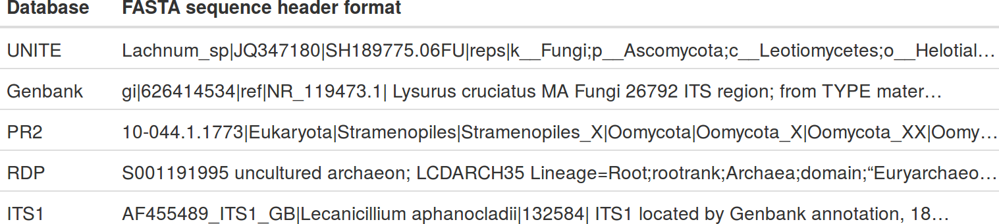

```{r setup, include=FALSE}
knitr::opts_chunk$set(echo = FALSE)
# options(crayon.enabled = TRUE)
options(width = 100)
```

## The challenges of taxonomic data

\begin{itemize}
  \setlength\itemsep{1em}
  \item Taxonomic data is hierarchical
  \item It is often associated with other data
  \item "Taxa" can be names, classifications of names, or IDs
  \item Each source of taxonomic data formats things differently
\end{itemize}

\vspace{5mm}



## What taxa provides

\begin{columns}
\begin{column}{0.45\textwidth}

\begin{itemize}
  \setlength\itemsep{1em}
  \item Classes to hold taxa, taxonomies, and associated data
  \item Flexible parsers to convert raw data to these classes
  \item Dplyr-inspired functions to manipulate these classes
  \item A flexible base for other packages to use
\end{itemize}

\end{column}
\begin{column}{0.8\textwidth}  %%<--- here
    \begin{center}
     \includegraphics[width=0.8\textwidth]{class_diagram.png}
     \end{center}
\end{column}
\end{columns}


## `taxmap`: user-defined data mapped to a taxonomy

\begin{figure}
  \makebox[\textwidth][c]{\includegraphics[width=0.9\textwidth]{taxmap_printed.png}}%
\end{figure}

## Reading data from diverse formats

\begin{figure}
  \makebox[\textwidth][c]{\includegraphics[width=1.2\textwidth]{parsing_guide.png}}%
\end{figure}

## `Dplyr`-like manipulation of taxonomic data

Subset taxonomy and data to one taxon:

```{r echo=TRUE, eval=FALSE}
filter_taxa(x, taxon_names == "Plantae", subtaxa = TRUE)
```

Subset taxonomy to one rank:

```{r echo=TRUE, eval=FALSE}
filter_taxa(x, taxon_ranks == "genus", supertaxa = TRUE)
```

Subset data and remove any taxa not in subset:

```{r echo=TRUE, eval=FALSE}
filter_obs(x, "info", n_legs == 4, drop_taxa = TRUE)
```

Add a column to a dataset:

```{r echo=TRUE, eval=FALSE}
mutate_obs(x, "info", bipedal = n_legs == 2)
```

